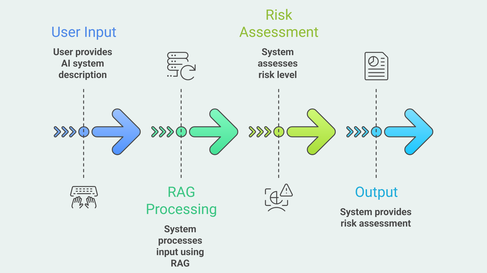
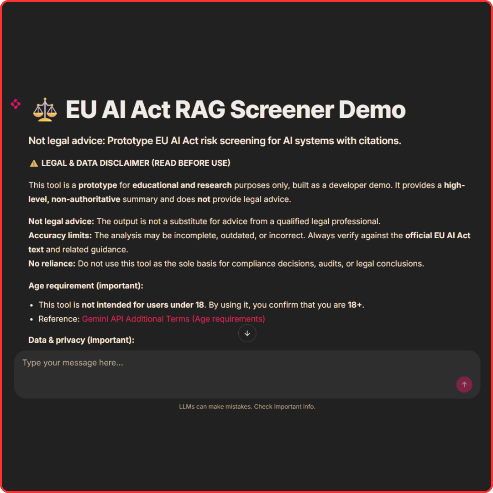

# EU AI Act RAG Screener Demo

[](https://huggingface.co/spaces/KaanGoker/EU-AI-Act-RAG-Screener-Demo)
[](https://github.com/KaanGoker/EU-AI-Act-RAG-Screener?tab=MIT-1-ov-file)
[](https://docs.chainlit.io)

⚠️ This tool is a **prototype** for **educational and research** purposes only, built as a developer demo. It provides a **high-level, non-authoritative** summary and does **not** provide legal advice. ⚠️

<h2 align="center">
  <strong>
    <a href="https://huggingface.co/spaces/KaanGoker/eu-ai-act-rag-screener-demo" target="_blank">🚀 Click Here to try the App Live On Hugging Face! 🚀</a>
  </strong>
</h2>

<p align="center">
  
</p>

<p align="center">
  
</p>

**EU AI Act RAG Screener Demo** is a compliance assistant that lets you chat with the official text of the EU AI Act. It uses Retrieval-Augmented Generation (RAG) to provide a *preliminary* risk-level assessment (Prohibited, High Risk, Limited Risk) based on your AI system description.

It features **real-time legal citations**, so each answer is grounded in retrieved passages and includes a clickable reference to the exact page in the official EUR-Lex PDF.

Powered by **Google Gemini** (`gemini-2.5-flash-lite` + `text-embedding-004`), the app aims for fast responses while staying anchored to the source text.

<h2 align="center">
  <strong>
    <a href="https://huggingface.co/spaces/KaanGoker/eu-ai-act-rag-screener-demo" target="_blank">🚀 Click Here to try the App Live On Hugging Face! 🚀</a>
  </strong>
</h2>

<p align="center">
  
</p>

---

## The Problem It Solves

The EU AI Act is long and dense. For developers and founders, figuring out whether a specific use case is “High Risk”, “Prohibited”, or “Limited Risk” often means hours of manual searching through legal language.

## The Solution

This tool works as a **preliminary screening assistant**:

1. You describe your AI system
2. The retriever pulls the most relevant EU AI Act passages from a vector database
3. The model responds with a sourced summary and shows **page-level references** you can open instantly

## ✨ Features

- **RAG architecture for legal text**: Retrieval-first answers grounded in the EU AI Act.
- **Source truth, page-level citations**: Each response attaches sources with links to the official [EUR-Lex PDF page](https://eur-lex.europa.eu/eli/reg/2024/1689/oj). English version of the EU AI Act is acquired from [this page](https://eur-lex.europa.eu/legal-content/EN/TXT/PDF/?uri=OJ:L_202401689).
- **Gemini integration**: Uses `gemini-2.5-flash-lite` for reasoning and `text-embedding-004` for retrieval.
- **Smart ingestion script**: Chunking + slow-mode embedding to avoid rate limits when rebuilding the database.
- **Compliance guardrails**: Mandatory disclaimer + age verification gate before access.
- **Chainlit UI**: Streaming responses, chat UX, and inline “source popup” elements.

## 🧰 Tech Stack

- **UI**: Chainlit
- **LLM**: Google Gemini (`gemini-2.5-flash-lite`)
- **Embeddings**: Google Gemini embeddings (`models/text-embedding-004`)
- **Orchestration**: LangChain
- **Vector DB**: ChromaDB (persistent local store in `./chroma_db`)
- **PDF Loading**: PyMuPDF (via LangChain loader)

## 💻 Usage

### 1) Installation

1. **Clone the repository**
```
   git clone https://github.com/YourUsername/EU-AI-Act-RAG-Screener-Demo.git  
   cd EU-AI-Act-RAG-Screener-Demo
```

2. **Install dependencies**
```
   pip install -r requirements.txt
```

3. **Add Your API Key to `.env`**

   Create a `.env` file in the project root:
``` 
   GOOGLE_API_KEY=your_api_key_here
```
---

### 2) Run the app (no ingestion needed)

This repository ships with a ready-to-use `chroma_db/`, so you can start the app right away.

```
chainlit run chainlit_app.py -w
```

The app will be opened in a new browser tab.

---

### 3) Optional: Rebuild the vector database

You only need to do this if:
- you deleted `chroma_db/`
- you want to re-ingest from scratch
- you want to ingest a different PDF version

Steps:

1. Put the official PDF here:
```
   data/eu_ai_act.pdf
```
2. Run ingestion:
```  
   python ingest.py
```

## ⚠️ DISCLAIMER ⚠️

**⚠️ LEGAL & DATA DISCLAIMER (READ BEFORE USE)**

This tool is a **prototype** for **educational and research** purposes only. It provides a **high-level, non-authoritative** summary and does **not** provide legal advice.

**Not legal advice:** The output is not a substitute for advice from a qualified legal professional.  
**Accuracy limits:** The analysis may be incomplete, outdated, or incorrect. Always verify against the **official EU AI Act text** and related guidance.  
**No reliance:** Do not use this tool as the sole basis for compliance decisions, audits, or legal conclusions.

**Age requirement (important):**
- This tool is **not intended for users under 18**. By using it, you confirm that you are **18+**.
- Reference: [Gemini API Additional Terms (Age requirements)](https://ai.google.dev/gemini-api/terms)

**Data & privacy (important):**
- **Do not paste personal data or confidential information** (names, emails, phone numbers, IDs, CVs, health data, contracts, internal company details).
- Your input is sent to **Google Gemini API** for processing.
- If you are using the demo hosted on **Hugging Face Spaces**, your data also passes through their infrastructure. Please review the [Hugging Face Privacy Policy](https://huggingface.co/privacy).
- This app does **not intentionally store** your input or the generated output.
- This app uses a **billing-enabled (paid tier)** Gemini API setup. According to Google’s paid tier documentation, prompts and responses **aren’t used to improve Google products**.
  - [Gemini API billing documentation](https://ai.google.dev/gemini-api/docs/billing)
  - [Gemini API Additional Terms](https://ai.google.dev/gemini-api/terms)

**Limitation of liability:** To the maximum extent permitted by law, the developer is not liable for damages or losses resulting from use of this prototype.

*By clicking "I Agree & Continue" in the app, you confirm you have read, understood, and accepted these terms.*

## 📄 License

This project is licensed under the MIT License.